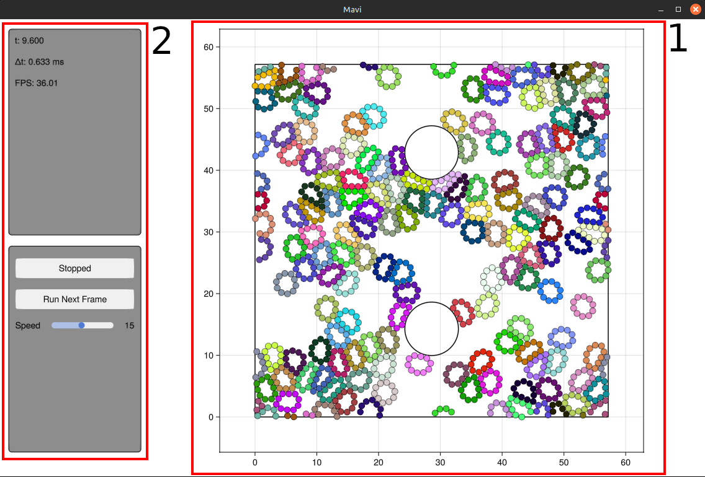

# Mavi

[](https://github.com/marcos1561/Mavi.jl/actions/workflows/CI.yml?query=branch%3Amain)

Mavi é um motor de dinâmica de partículas (_Particle Dynamic Engine_).


# Objetivo

O objetivo do Mavi é servir como objeto de estudo de física e programação em geral, e das funcionalidades de Julia em particular.

O pacote é pensado de maneira a ser o mais modularizado possível, permitindo uma estrutura geral para os programas que independa das particularidades do sistema estudado. Ele é dividido em módulos dedicados a cada aspecto do sistema e do programa: a definição do estado e do sistema; as configurações dinâmicas, espaciais e de integração numérica; os inicializadores e verificadores; a visualização; a coleta de dados etc.


# Estado e sistema

O móudlo principal `Mavi.jl` contém as estruturas que definem o estado e o sistema.

## Estado
O *estado* é descrito pela *posição* e *velocidade* de todas as partículas, implementado por meio da estrutura `Mavi.State(pos, vel)`. `pos` e `vel` são matrizes $N \times 2$ contendo, respectivamente, as coordenadas $(x,y)$ e as velocidades $(v_x,v_y)$ de cada partícula.

## Sistema
O *sistema*, por sua vez, contém, além do *estado* das partículas, as configurações espaciais, dinâmicas e de integração; a diferença de posição, a força e o módulo da distância entre as partículas; e o número de partículas. É implementado pela estrutura `Mavi.System(...)`, que recebe uma sequência de parâmetros. Há também uma função inicializadora que retorna uma instância de `Mavi.System`; mais detalhes podem ser vistos em [Mavi.jl](src/Mavi.jl).


# Configurações do sistema

O módulo `Configs` reúne diversas configurações do sistema descritas por diferentes tipos:

## Configurações espaciais: `Configs.SpaceCfg`
O sistema pode ser colocado em uma caixa retangular por meio da estrutura `RectangleCfg(length, height)` ou em um recipiente circular por meio da estrutura `CircleCfg(radius)`.

Caso desejado, o usuário pode definir sua própria configuração espacial, bastando para isso definir uma nova estrutura pertencente ao tipo `SpaceCfg`.

## Configurações dinâmicas: `Configs.DynamicCfg`
Aqui são definidos os potenciais de interação entre as partículas. Já estão definidos dois deles:

- Potencial harmônico truncado: `HarmTruncCfg(ko, ro, ra)`
- Potencial de Lennard-Jones: `LenJonesCfg(sigma, epsilon)`

Os detalhes dos parâmetros podem ser consultados em [configs.jl](src/configs.jl).

A partir do potencial de interação define-se um "raio efetivo" para cada partícula, que será usado na visualização. Essa quantidade é definida pela função `particle_radius(dynamic_cfg)`, que recebe como argumento uma configuração dinâmica particular e define o raio da partícula a partir de um dado parâmetro da configuração dinâmica.

Novamente, o usuário pode implementar qualquer configuração dinâmica, bastando definir uma estrutura do tipo `DynamicCfg` com os respectivos parâmetros e o correspondente raio da partícula com `particle_radius(...)`.

## Configurações de integração: `Configs.AbstractIntCfg`
As configurações de integração são um pouco mais complexas e envolvem duas possibilidades: a integração numérica simples e a integração pelo "método das caixas", aqui chamadas de *chunks*. As respectivas estruturas, pertencentes ao tipo abstrato `AbstractIntCfg`, são

- Integração simples: `IntCfg`
    A integração numérica é feita diretamente, e a estrutura `IntCfg` recebe como parâmetro apenas o passo de integração `dt`.

- Integração por *chunks*: `ChunksIntCfg`
    O sistema é dividido em caixas, ou *chunks*, e a interação entre partículas é calculada apenas sobre as caixas vizinhas, simplificando muito o cálculo e consequentemente diminuindo o tempo de simulação. Essa opção é útil quando as interações não têm alcance muito grande.

    A estrutura `ChunksIntCfg` recebe como parâmetros o passo de integração `dt` e uma outra estrutura chamada `ChunksCfg(num_cols,num_rows)`.


# Integração

As etapas referentes à integração numérica estão definidas no módulo `Integration`. Detalhes podem ser vistos em [integration.jl](src/integration.jl), mas aqui destacamos a ideia central do método e do Mavi como um todo: a função `step!()`.

## Função `step!()`
A modularização do pacote e a funcionalidade de despacho múltiplo em Julia permite a criação de funções gerais que podem ser facilmente utilizadas em diversos contextos. A função `step!(system, int_cfg)` segue essa ideia, sendo a parte fundamental da integração numérica: ela recebe como argumento apenas o sistema e as configurações de integração, sendo independente da interação entre as partículas. Sua estrutura é bastante simples:

### Sem o uso de *chunks*

```julia
function step!(system::System, int_cfg::IntCfg)
    calc_forces!(system)
    update_verlet!(system, calc_forces!)
    rigid_walls!(system, system.space_cfg)
end
```

O primeiro passo consiste em calcular a força entre as partículas. Graças ao despacho múltiplo, a função `calc_forces!()` determina automaticamente qual o cálculo correto da interação, definido previamente na função `calc_interaction()`. Assim, para qualquer nova configuração dinâmica, basta definir o despacho da função `calc_interaction()` para esta nova configuração.

Em seguida, a função utiliza o método de integração desejado. O Mavi tem implementado o método de Verlet, chamado pela função `update_verlet!(system, calc_forces!)`. Para utilizar outros métodos, basta definir a função correspondente e utilizá-la em uma função `step!()` customizada.

Por fim, a função aplica as condições do contorno desejadas. A função implementada aqui é a de paredes rígidas, que inverte a velocidade das partículas em caso de colisão com os limites do sistema. Essa função é chamada por `rigid_walls!(system, system.space_cfg)`, que recebe como argumentos o sistema e as configurações espaciais. Para configurações diferentes da retangular e da circular, o usuário deve definir o despacho de `rigid_walls!()` para a configuração em questão.

### Com o uso de *chunks*

```julia
function step!(system::System, int_cfg::ChunksIntCfg)
    update_chunks!(system.chunks)
    calc_forces_chunks!(system)
    update_verlet!(system, calc_forces_chunks!)
    rigid_walls!(system, system.space_cfg)
end
```

A estrutura da função `step!()` nesse caso é bastante parecida com a anterior, mas com um passo adicional no início: a chamada de `update_chunks!(system.chunks)`. Por ser um cálculo muito diferente em relação à integração simples, optou-se por definir funções específicas para o uso de *chunks*, ao invés do despacho múltiplo. Assim, utiliza-se a função `calc_forces_chunks!()` ao invés de `calc_forces!()`, por exemplo.


# Quantidades físicas

O módulo `Quantities` contém funções que retornam quantidades físicas de interesse. Há duas delas definidas atualmente:

- Energia cinética:
    A energia cinética do sistema é calculada pela função `kinetic_energy(state)`, que recebe o estado do sistema como parâmetro. Por depender apenas das velocidades, é independente das configurações dinâmicas escolhidas.

- Energia potencial:
    A energia potencial do sistema é calculada pela função `potential_energy(system, dynamic_cfg)`, que recebe como argumentos o sistema e as configurações dinâmicas, visto que depende da escolha da interação entre as partículas.
    O usuário deve estar atento para definir o despacho correto da função `potential_energy()` para uma configuração dinâmica customizada.


# Interface visual

O Mavi possui uma interface visual (feita inteiramente com o [Makie](https://docs.makie.org/v0.21/)) cujo objetivo é servir de ferramenta de depuração visual para o sistema sendo explorado. A estrutura da UI possui essencialmente dois elementos:

1. Gráfico onde as partículas do sistema são renderizadas em tempo real.
2. Painel de informações sobre o estado do sistema e execução do programa.

<!--  -->


## Animando o sistema
Dado que um função `step!(system, int_cfg)` já está construída para algum `system`, podemos animar o processo de integração da seguinte forma

```julia
using Mavi.Visualization

# Criando o sistema
system = ...

animate(system, step!)
```

É possível configurar aspectos da animação passando uma instância de `AnimationCfg` em `animate`. O seguinte exemplo anima o sistema com o fps setado para 30, executando 15 passos temporais a cada frame da animação 

```julia
using Mavi.Visualization

# Criando o sistema
system = ...

anim_cfg = AnimationCfg(
    fps = 30,
    num_steps_per_frame = 15,
)

animate(system, step!, anim_cfg)
```

## Estendendo o painel de informações
É possível injetar informações customizáveis no painel de informações. Fazemos isso setando o campo `custom_items` de `DefaultInfoUICfg`, que por sua vez é um campo de `AnimationCfg`. `custom_items` é uma função que deve retornar as informações adicionais que serão mostradas no painel de informações. Para informações mais detalhadas de sua assinatura, consulte sua documentação em [info_ui.jl](src/gui/info_ui.jl).  
O seguinte exemplo utiliza um sistema já definido no Mavi e adiciona a informação da posição da primeira partícula no painel de informações

```julia
using Mavi
using Mavi.Configs
using Mavi.Visualization
using Printf

system = System(
    state = State{Float64}(
        pos = [[1 2 3]; [1 2 3]],
        vel = [[1 1 0]; [-1 0 2]],
    ),
    space_cfg = RectangleCfg(length=4, height=4),
    dynamic_cfg = LenJonesCfg(sigma=1, epsilon=0.1),
    int_cfg = IntCfg(dt=0.01),
)

function get_pos(system, _)
    pos = system.state.pos[:, 1]
    pos_formatted = @sprintf("(%.3f, %.3f)", pos[1], pos[2])
    return [("pos_1", pos_formatted)]
end

anim_cfg = AnimationCfg(
    info_cfg = DefaultInfoUICfg(
        custom_items = get_pos
    )
)

animate(system, Mavi.Integration.step!, anim_cfg)
```
