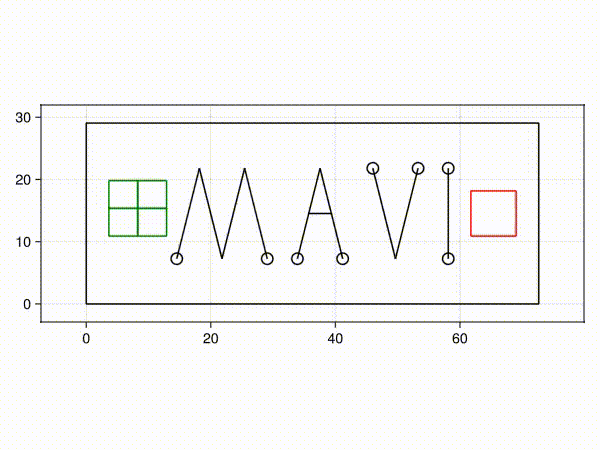

# Mavi.jl

Mavi is a _Particle Dynamics Engine_.

  
*See the code that generated this video here: [examples/welcome_video.jl](/examples/welcome_video.jl)*

Its goal is to provide a common structure for implementing particle dynamics simulations, allowing users to use default behaviors or create their own as needed.

Take a look at the [documentation](https://marcos1561.github.io/Mavi.jl/dev/).
