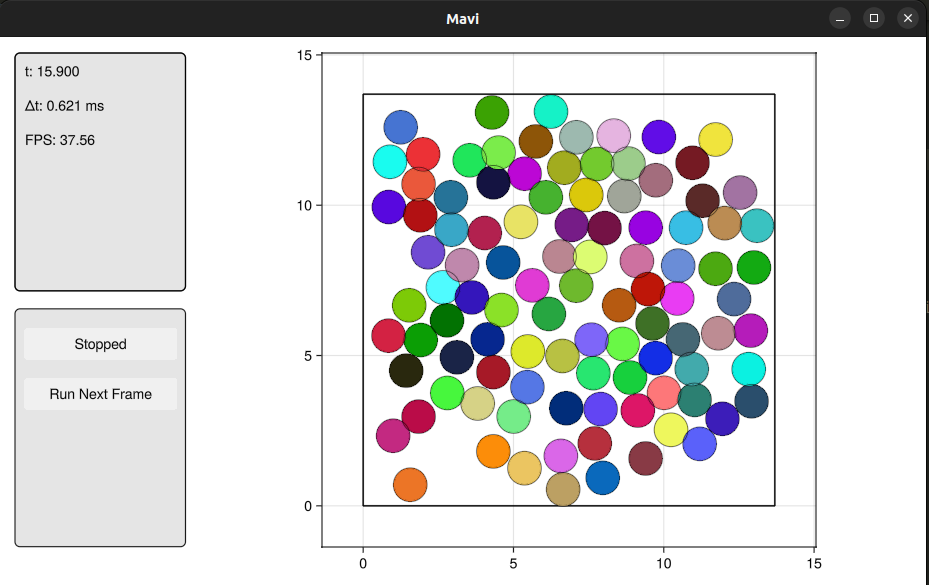

# Quick Start
Let's create a gas of particles. The first thing we need to do is create the system's state. Particles' positions will be initialized at the vertices of a rectangular grid with random velocities. To initialize the positions, we need to know the particle radius, which is defined by the interaction potential between them (in this example we will use a Lennard-Jones potential). The particle radius can be accessed via the `particle_radius()` function:  

```julia
using Mavi.Configs
using Mavi.States
using Mavi.InitStates

function main()
    # Init state configs
    num_p_x = 10 # Number of particles in the x direction
    num_p_y = 10 # Number of particles in the y direction
    offset = 0.4 # Space between particles

    num_p = num_p_x * num_p_y
    dynamic_cfg = LenJonesCfg(sigma=1, epsilon=1) # Interaction potential between particles
    radius = particle_radius(dynamic_cfg)

    # rectangular_grid returns positions in a rectangular grid (`pos`) and
    # a rectangular geometry configuration that contains all positions (geometry_cfg)
    pos, geometry_cfg = rectangular_grid(num_p_x, num_p_y, offset, radius)
    
    # Creating a state compatible with Newton's Second Law
    state = SecondLawState(
        pos=pos,
        vel=random_vel(num_p, 1/5),
    )
end
```

Next, we need to specify the space where the particles live. Luckily, `rectangular_grid()` already gives us a geometry configuration that contains all the positions created, we only need to specify how the walls behave (we will use rigid walls)

```julia
using Mavi.Configs
using Mavi.States
using Mavi.InitStates

function main()
    # Init state configs
    num_p_x = 25 # Number of particles in the x direction
    num_p_y = 25 # Number of particles in the y direction
    offset = 0.4 # Space between particles

    num_p = num_p_x * num_p_y
    dynamic_cfg = LenJonesCfg(sigma=1, epsilon=1) # Interaction potential between particles
    radius = particle_radius(dynamic_cfg)

    # rectangular_grid returns positions in a rectangular grid (`pos`) and
    # a rectangular geometry configuration that contains all positions (geometry_cfg)
    pos, geometry_cfg = rectangular_grid(num_p_x, num_p_y, offset, radius)
    
    # Creating a state compatible with Newton's Second Law
    state = SecondLawState(
        pos=pos,
        vel=random_vel(num_p, 1/5),
    )

    # Creating space configurations
    space_cfg = SpaceCfg(
        wall_type=RigidWalls(),
        geometry_cfg=geometry_cfg,
    )
end
```
Now we can put it all together in a `System` and animate! 

```julia
using Mavi
using Mavi.Configs
using Mavi.States
using Mavi.InitStates

using Mavi.Visualization

function main()
    # Init state configs
    num_p_x = 10 # Number of particles in the x direction
    num_p_y = 10 # Number of particles in the y direction
    offset = 0.4 # Space between particles

    num_p = num_p_x * num_p_y
    dynamic_cfg = LenJonesCfg(sigma=1, epsilon=1) # Interaction potential between particles
    radius = particle_radius(dynamic_cfg)

    # rectangular_grid returns positions in a rectangular grid (`pos`) and
    # a rectangular geometry configuration that contains all positions (geometry_cfg)
    pos, geometry_cfg = rectangular_grid(num_p_x, num_p_y, offset, radius)
    
    # Creating a state compatible with Newton's Second Law
    state = SecondLawState(
        pos=pos,
        vel=random_vel(num_p, 1/5),
    )

    # Creating space configurations
    space_cfg = SpaceCfg(
        wall_type=RigidWalls(),
        geometry_cfg=geometry_cfg,
    )

    system = System(
        state=state, 
        space_cfg=space_cfg,
        dynamic_cfg=dynamic_cfg,
        int_cfg=IntCfg(dt=0.01), # Configurations related to how the system is integrated, such as the time step (dt)
    )

    animate(system)
end
```

After running `main()`, you should see this:
 
