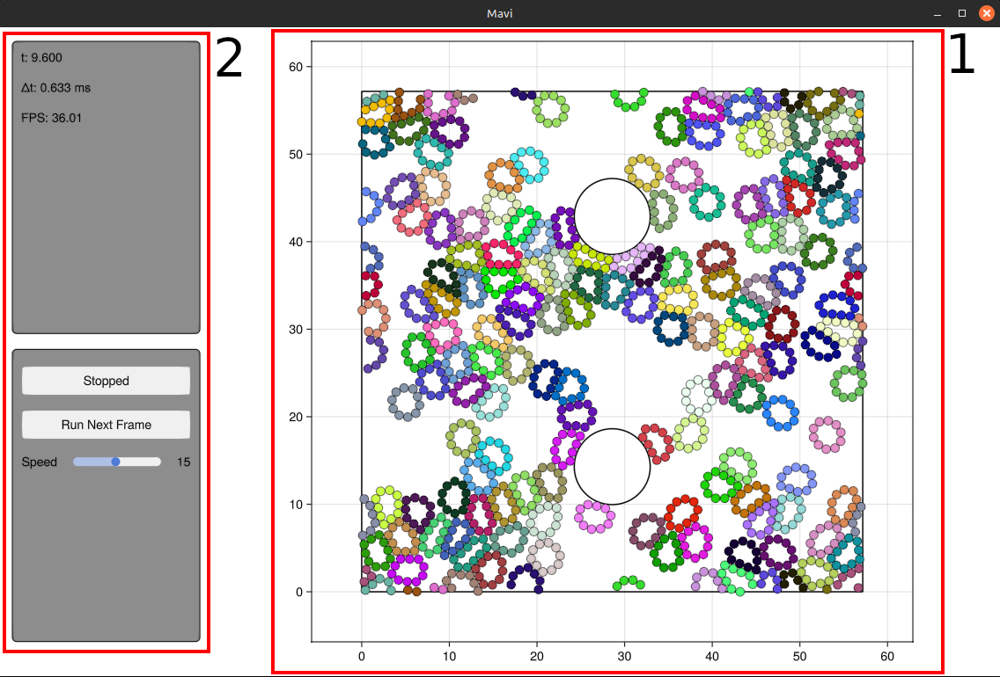

# Visual Interface
Mavi has a visual interface (built entirely with [Makie](https://docs.makie.org/v0.21/)) whose purpose is to serve as a visual debugging tool for the system being explored. The UI structure essentially has two main elements:

1. A plot where the system's particles are rendered in real time.
2. A panel showing some information and buttons to control the animation.



## Animating the system
To animate a system, simply call the function `animate` inside the module `Mavi.Visualization`

```julia
using Mavi.Visualization

# Creating the system
system = ...

animate(system)
```

and if you have a custom step function called `my_step!`

```julia
using Mavi.Visualization

# Creating the system
system = ...

animate(system, step_func=my_step!)
```

It is possible to configure aspects of the animation by passing an instance of `AnimationCfg` to animate. The following example animates the system with the FPS set to 30, executing 15 time steps per animation frame:

```julia
using Mavi.Visualization

# Creating the system
system = ...

anim_cfg = AnimationCfg(
    fps=30,
    num_steps_per_frame=15,
)

animate(system, anim_cfg)
```

## Extending the Information Panel
It is possible to inject custom information into the information panel. This is done by setting the `custom_items` field of `DefaultInfoUICfg`, which in turn is a field of `AnimationCfg`. `custom_items` is a function that should return the additional information to be displayed in the information panel. For more details about its signature, see the documentation in [`info_ui.jl`](https://github.com/marcos1561/Mavi.jl/blob/main/src/gui/info_ui.jl).

The following example uses a system already defined in `Mavi.jl` and adds the position of the first particle to the information panel.

```julia
# Creating a System
system = System(
    state = SecondLawState(
        pos=[[1 2 3]; [1 2 3]],
        vel=[[1 1 0]; [-1 0 2]],
    ),
    space_cfg=SpaceCfg(
        wall_type=RigidWalls(),
        geometry_cfg=RectangleCfg(length=4, height=4),
    ),
    dynamic_cfg=LenJonesCfg(sigma=1, epsilon=0.1),
    int_cfg=IntCfg(dt=0.01),
)

# Function used to show particle position
# in the information panel
function get_pos(system, _)
    pos = system.state.pos[1]
    pos_formatted = @sprintf("(%.3f, %.3f)", pos[1], pos[2])
    return [("pos[1]", pos_formatted)]
end

anim_cfg = AnimationCfg(
    info_cfg=DefaultInfoUICfg(
        custom_items=get_pos
    ),
    graph_cfg=MainGraphCfg((
        CircleGraphCfg(), # Render particles as circles
        NumsGraphCfg(), # Show particle indices
    ))
)

animate(system, anim_cfg)
```